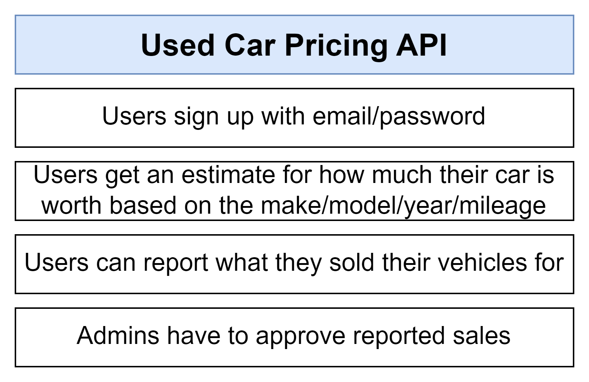
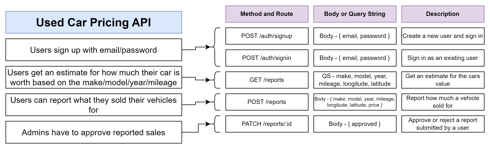
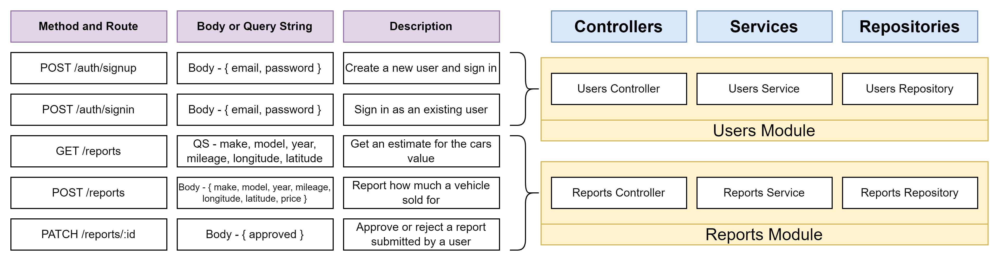

<p align="center">
  <a href="http://nestjs.com/" target="blank"></a>
</p>

[circleci-image]: https://img.shields.io/circleci/build/github/nestjs/nest/master?token=abc123def456
[circleci-url]: https://circleci.com/gh/nestjs/nest

  <p align="center">A progressive <a href="http://nodejs.org" target="_blank">Node.js</a> framework for building efficient and scalable server-side applications.</p>
<!-- title of the app -->
<h1 align="center">NestJS - Car pricing estimator api</h1>

## Features:



## Description:



### Folder structure:



### Installation:

```bash
$ npm install
```

### Running the app:

```bash
# development
$ npm run start:dev
# production mode
$ npm run start:prod
```

#### Try the apis using request.rest file:

We have a request.rest file in the each folder module, you can use it to test the apis.
